# Java Application Deployment Lab on DigitalOcean

## Overview

This lab demonstrates how to securely deploy and operate a Java Spring Boot application on a cloud server using **DigitalOcean**, following real-world **Application Manager / DevOps** practices.

The focus is not just running an application, but:
- Hardening the server
- Enforcing secure access
- Building and packaging a Java application
- Deploying and validating the application in production-like conditions

---

## Architecture Summary

- **Client:** Developer workstation (Windows + Git Bash + IntelliJ IDEA)
- **Cloud Provider:** DigitalOcean
- **Compute:** Ubuntu 22.04 Droplet
- **Runtime:** OpenJDK 17
- **Build Tool:** Gradle
- **Application:** Spring Boot (embedded Tomcat, port 8080)
- **Access:** SSH key-based authentication
- **Security:** UFW firewall, non-root user, SSH hardening

---

## Project Structure

The project follows a standard Gradle-based Java application structure. The source code resides under src/main/java/com/example, containing the main Spring Boot entry point App.java and the REST controller HelloController.java. Build artifacts are generated in the build/libs directory, including the executable java-app-1.0-SNAPSHOT.jar and the corresponding -plain JAR. The project is managed using Gradle, with build.gradle defining dependencies and build logic, gradlew providing the Gradle wrapper for consistent builds across environments, and settings.gradle handling project-level configuration.

---
## Deployment Phases

###  Phase 1-7: Server Hardening
###  Phase 8-12: Application Prep & Transfer
### Phase 13-16: Execution & Validation
###  Phase 17-18: Application Shutdown & Cleanup

---

## Phase 1 — Droplet Creation
- Created Ubuntu 22.04 Droplet on DigitalOcean
- Selected region and size suitable for Java workloads
- Added SSH key during creation

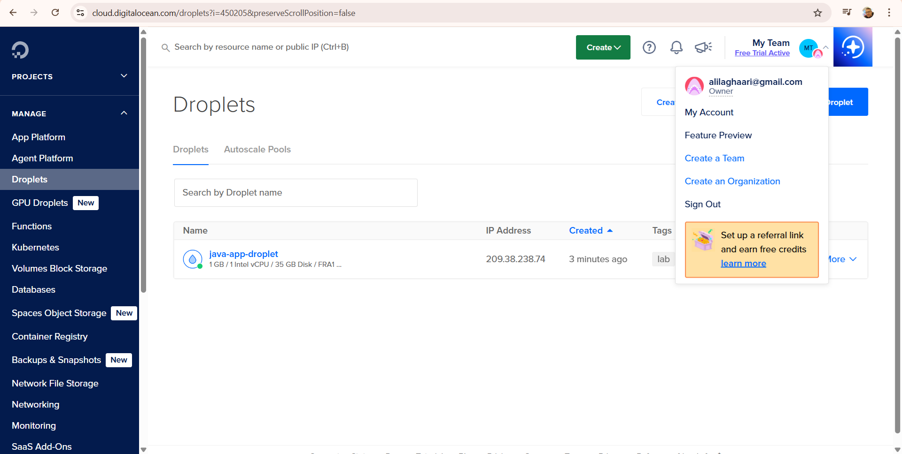

## Phase 2 — Initial Root SSH Login
- Logged in using SSH as root for initial configuration

  - Root Login (Initial Access)
  - ssh root@209.38.238.74

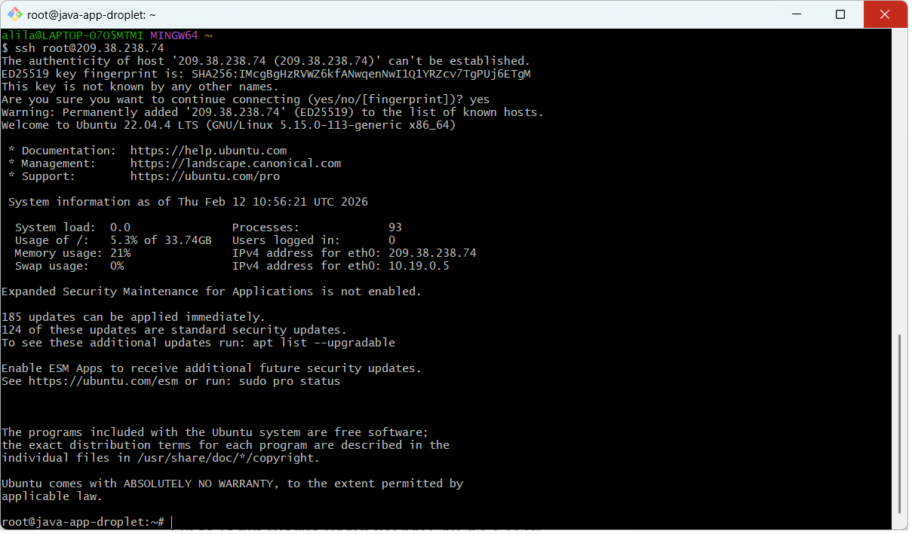

## Phase 3 — Create Non-Root User
- Created a dedicated application user
- Added user to sudoers group

  - adduser ali
  - usermod -aG sudo ali

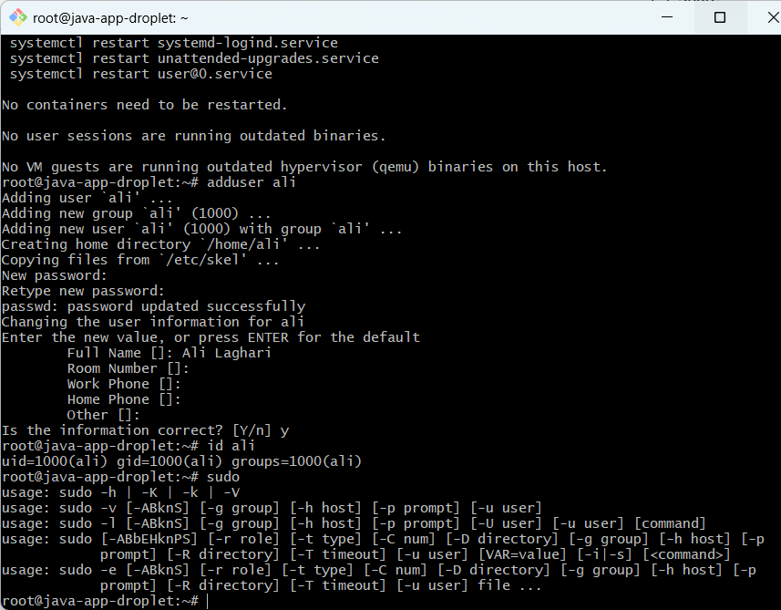

## Phase 4 — Copy SSH Keys to Non-Root User
- Copied SSH keys from root to non-root user
  
  - rsync --archive --chown=ali:ali ~/.ssh /home/ali

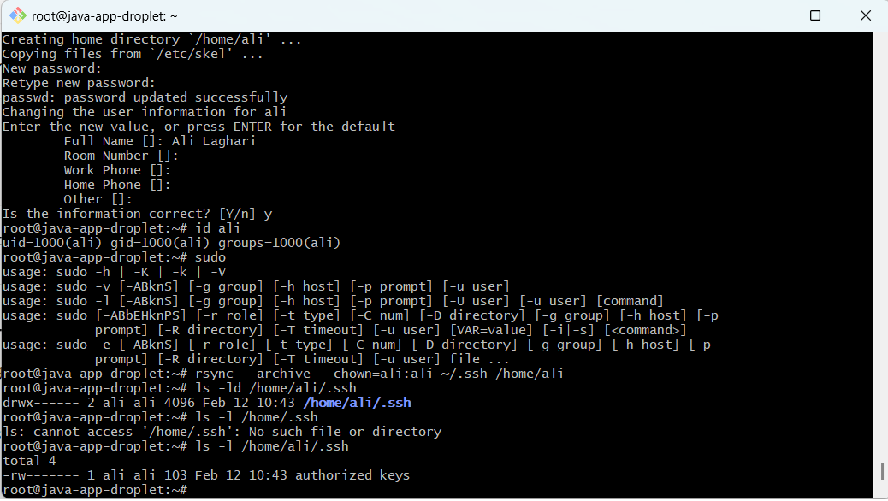

## Phase 5 — SSH Hardening
- Edited SSH configuration to improve security
- Disabled root login
- Enforced key-based authentication

  - sudo nano /etc/ssh/sshd_config
  - sudo systemctl restart ssh

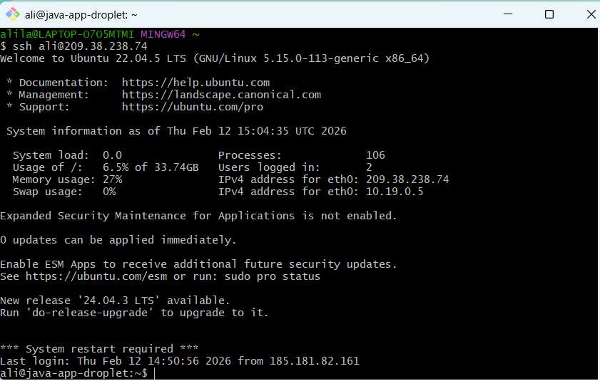

## Phase 6 — Firewall Configuration (UFW)
- Allowed SSH traffic
- Enabled firewall protection

  - sudo ufw allow OpenSSH
  - sudo ufw enable
  - sudo ufw status  

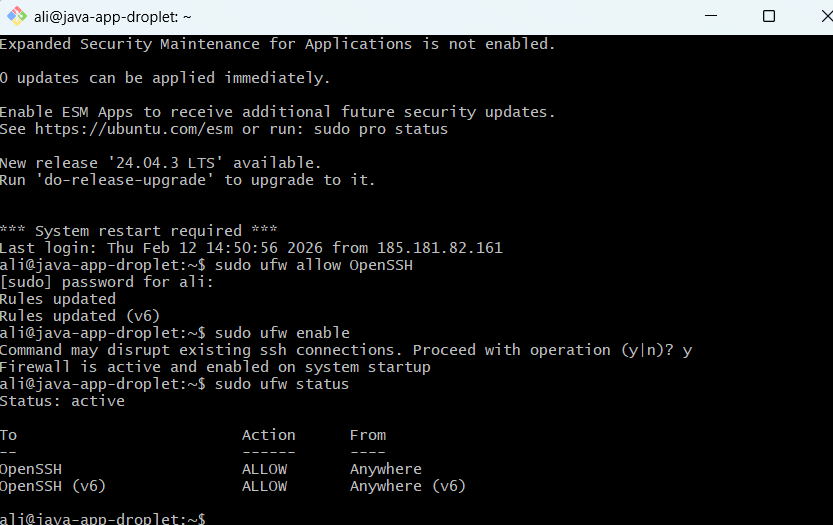

## Phase 7 — Reboot and Access Verification
- Rebooted server (droplet)
- Verified SSH login using non-root user

  - sudo reboot
  - ssh ali@209.38.238.74

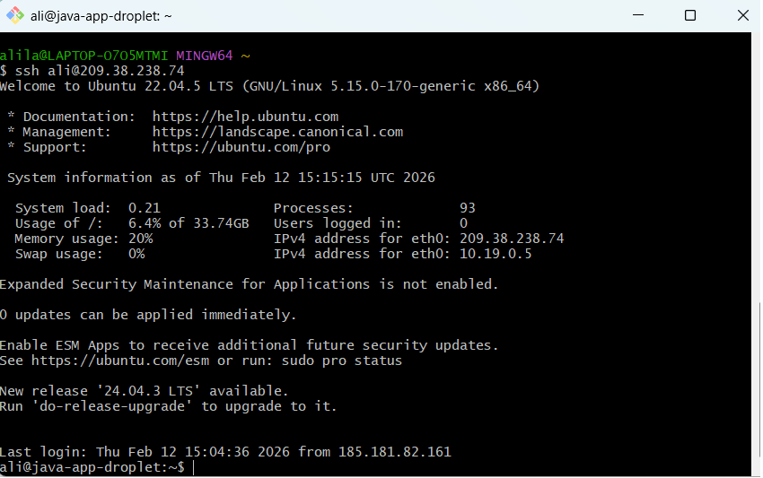

---

## Phase 8 — Grant Sudo Access Validation
- Verified sudo access for non-root user

  - sudo whoami

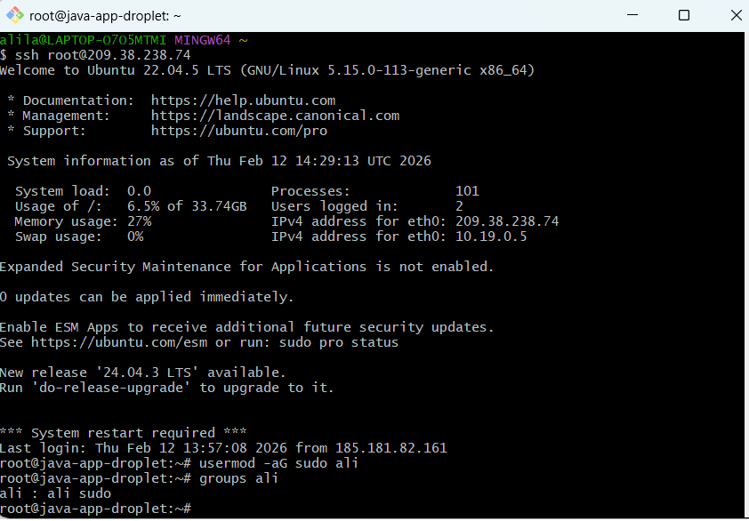

## Phase 9 — Build Java Application Locally
- Built Spring Boot application using Gradle Wrapper

  - ./gradlew clean build

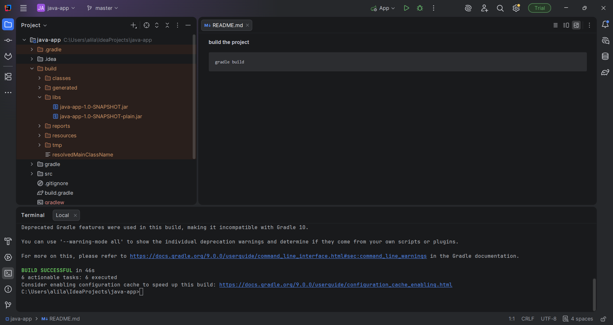

## Phase 10 — Install Java on Droplet
- Installed OpenJDK 17
- Verified Java runtime

  - sudo apt update
  - sudo apt install -y openjdk-17-jdk
  - java -version 

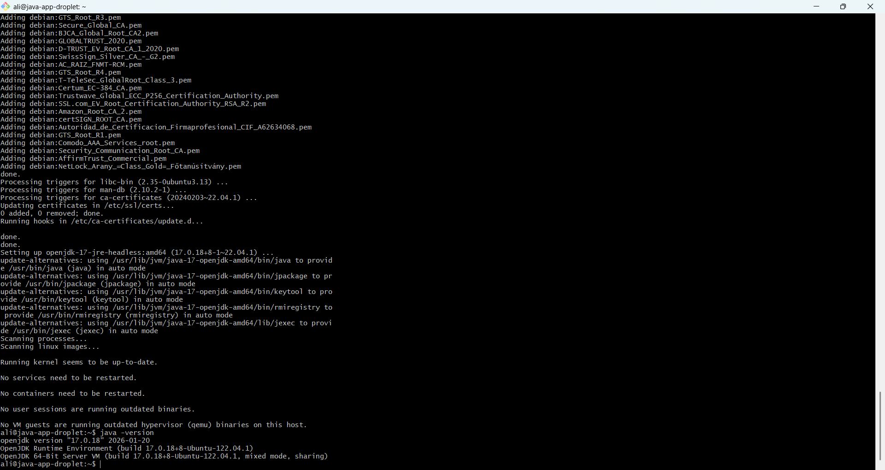

## Phase 11 — Create Application Directory
- Created a dedicated directory for application deployment

  - mkdir -p ~/apps/java-app

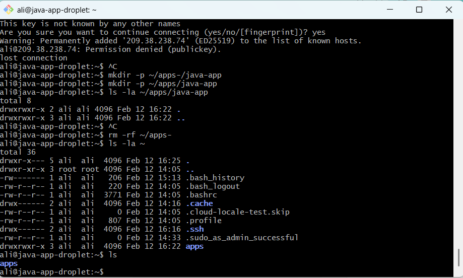

## Phase 12 — Transfer Application Artifact
- Copied built JAR file to the Droplet

  - scp build/libs/java-app-1.0-SNAPSHOT.jar ali@<droplet-ip>:~/apps/java-app/

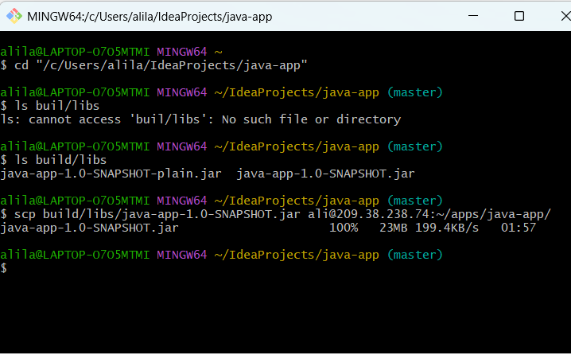

## Phase 13 — Verify Artifact on Server (Droplet)
- Confirmed JAR file presence and permissions

  - ls -la ~/apps/java-app

.png)

## Phase 14 — Start Application
- Started Spring Boot application using nohup
- Redirected logs to file

  - nohup java -jar java-app-1.0-SNAPSHOT.jar > app.log 2>&1 &

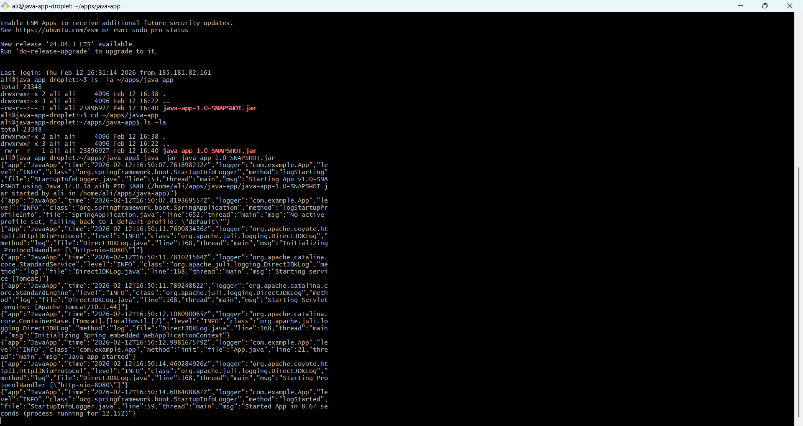

## Phase 15 — Port and Process Validation
- Copied built JAR file to the Droplet

  - ss -lntp | grep 8080

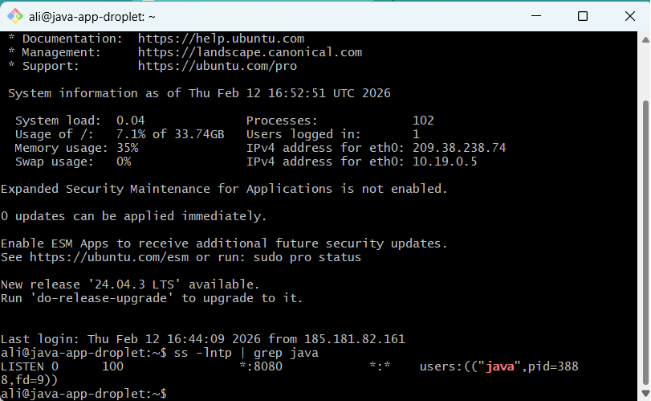(screenshots/17-ufw-allow-8080.png)

## Phase 16 — Application Access & Validation
- Verified application endpoints via browser
  - /
  - /health
    
- Validated via browser:
  - http://<droplet-ip>:8080/
  - http://<droplet-ip>:8080/health

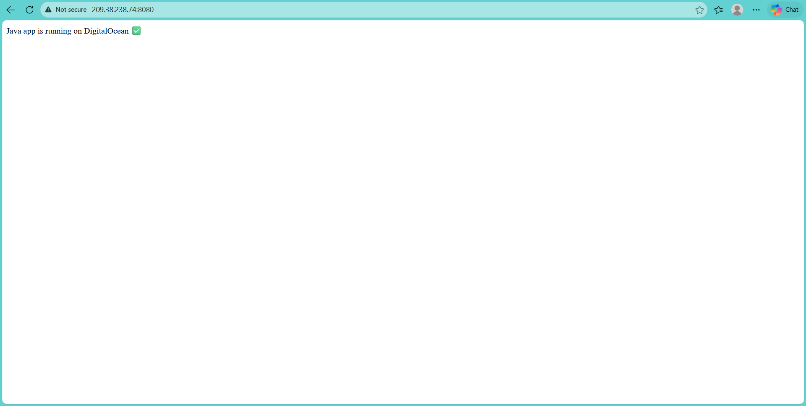(screenshots/24-browser-health.png)

---

## Phase 17 — Application Shutdown
- Stopped the application

  - ps -ef | grep java
  - kill <pid>

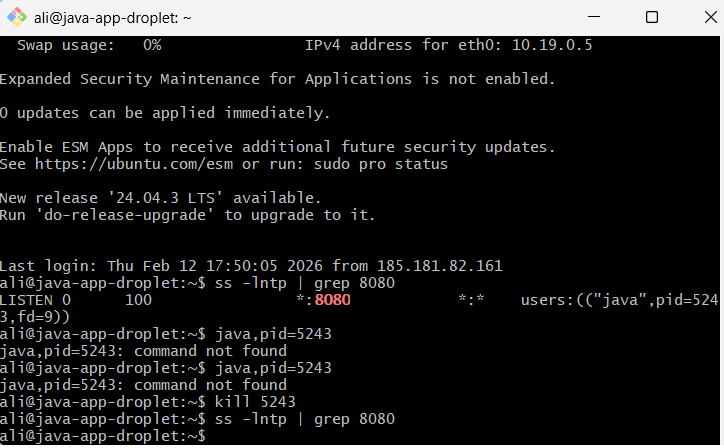

## Phase 18 — Droplet Cleanup
- Verified application endpoints via browser

  - /
  - /health

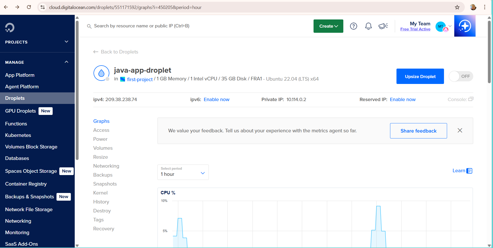

---

